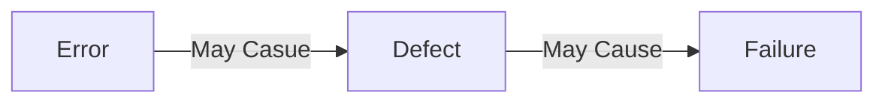
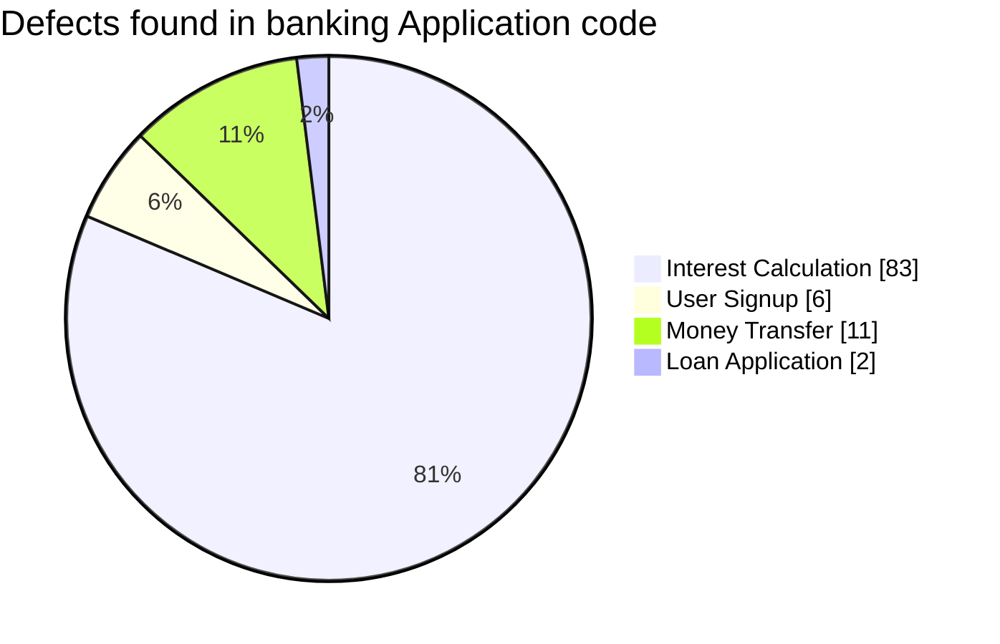

- Software Testing is a way to assess the quality of software and reduce the risk of failures during operation
- Dynamic Testing vs Static Testing
  - Dynamic: Execution of the part of the software being testing
  - Static: Not executing the software while testing
- Verification vs Validation
  - Verification: Does the software meet requirements
  - Validation: Does the software acually *fulfill* the client's expectations

### Objectives of Testing
- Minimize the risk of defects making it to the final application
- Verify that all requirements are fulfilled
- Create confidence that an application works as intended
- Comply with legal or compliance regulations

### How Testing Improves Quality
- Spot defects in requirements and user stories
  - Prevent features that are unimplementable or contradictory
- System/Code design
  - Building applications with testing in mind promotes code quality and architecture
- Spot defects in applications before put before users

- Quality Management
  - Everything related to maintaining quality in a company
  - **Quality Assurance**
    - Always Following the standard procedures and processes
  - **Quality Control**
    - The various activities and testing procedures that help ensure quality

- Examples
  - Error: Minimum account balance for making an account is listed as $900 instead of $400 due to bad handwriting
  - Defect: The developer writes code that prevents creation of accounts with less than $900
  - Failure: The user story/ requirement that anyone with $500 can create an account fails

# 7 principles of testing
### Testing Reveals defects, not their absence
- You cannot prove a negative
- You cannot confirm an applicaiton has no defects. 
  - Only that given your Quality Control no defects emerged
### Exhaustive Testing is impossible
- Testing takes time and effort.
- Testers must pritorize and optimize to meet client expectations
### Test Early
- Spotting defects early saves time and effort later
### Defects Cluster
- Defects tend to congreagate around certain pieces of code
- If there are 100 defects in an application
  - More likely: most defects are from one software component 
  - less likely: Defects are evenly split throughout the software.

### Pesticide Paradox
- The same tests with the same data over time will stop revealing new defects
  - You found the defects you could with the data provided
### Testing is Context Dependent
- Expect the style and rigor of testing to change based on requirements and application
  - Software for a pacemaker will be more vetted than and online video game leaderboard
  - Every testing team will have different team compositions
  - **Examples**
    - Business domain
      - Example: Banking and finance have laws to comply with
    - Budget
    - Organization policy
    - Test Types and levels considered
    - Technial ability of the test team
    - 
### Absence of errors fallacy
- Having an application with no defects/failures does not mean the application is *good*
- A rent payment app could have 0 errors but be so slow and tedious to use that the application as a whole is still a failure

### Test Activities
- Test Planning
  - Define the Objectives of testing
  - Test context used to create Test Plans
  - Deliverable/product:
    - ***Test Plan***
- Test Monitoring and control
  - Tracking the progress of tests
  - What tests have been completed
  - Keeping track of all related testing logs and metrics
  - Deliverable/product:
    - ***Test Progress Report***
      - What has been executed
      - How are the requiremennts coming along
- Test Analysis
  - ***What to Test***
  - Review the test basis for what to test
  - Specify required components for testing
  - Find inconsitencies and omissions in the test basis
  - Identify functional and non-functional testing
- Test Design
  - ***How to Test***
  - Test data to be used
  - Prioritizing test cases
  - Test environment and tools
  - Creating a traceability matrix
  - Deliverable/product:
    - ***Test cases***
      - High Level Test cases that can break down into concrete test cases
    - ***Test Data***
      - Values to be used in test cases
- Test Implementation
  - **Set up a testing exeuction schedule**
  - Loading test data into the test environment
  - Map out traceability between test cases, test conditions, test basis, test suites
  - Deliverable/product:
    - ***Test Execution Schedule***
    - ***Test Suite***
- Test Execution
  - Log outcome of tests
  - Record actual results vs expected for a test case
  - Analyze failures to find defects and root causes
  - Deliverable/product:
    - ***Defect Reports***
    - ***Test case status***
- Test completion
  - Analyze test results to see how better to do testing
  - Create a test summary to be handed to stakeholders
  - Close defect reports
    - list any pending defects
  - Deliverable/product:
    - ***Test Summary Report***

### Tester mindset
- Professional Pessisism
  - Assume what is built will fail
- Curiosity and experimentations
- Bringing together the team
  - Testers sit between developers and clients

### Developer Mindset
- Assume what is built will work
- Confirmation bias
  - Difficult to find problems to the solutions you created
- Some developers are involved in testing the code
  - Independent testers are prerferred for safety/critical features due to confirmation bias
