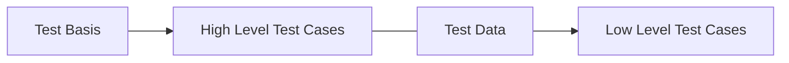

# Test Case
- Test case is high level
- Test cases are often *NOT* executable by itself
- Test data will allow for several concrete low level test cases to be designed
- Inputs and expected results

