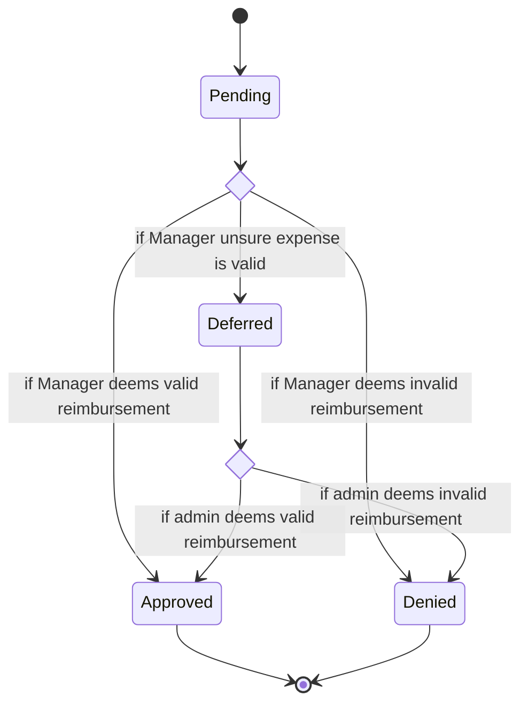

## Test Techniques
- White Box
  - Focuses on testing the structure
  - The process and flow within the test object
- Black Box
  - Focuses on input and output regardless of implementaiton
- Experience
  - Tests conducted by a tester having *experience* in a relavent domain
  - Can occur with ad hoc testing and when the requirements are ill-defined
  - Example
    - Experience from working on shopping apps before guides the tester making numerous tests around the shoppin kart
      - It is common for items in the kart not to update or remove correctly

# Black Box Techniques
## Equivalence Partitioning
- A method for testing where there are a range of inputs or multiple values possible
- Possible inputs are broken down into **Equivalence Partitions** aka **Equivalence Classess**
- Partitions must not overlap
  - Data from each partition is used to generate test cases
- These partitions are broken down into *valid* and *invalid* partitions
- *there is no official style of table*
  - Sould be customized for use case/ testing team

#### Example
Created usernames must be greater than 8 characters but less than 20. 

|Invalid|valid|Invalid|
|-------|-----|-------|
|8 Characters | 9 -19 characters| 20 Characters| 

Test cases
- If you input "adam1777" then you should not be able to create the account
- If you input "elizabethMiddleton" then you should be able to create the account
- If you input "JacobIsthecoolestdudethatthereeverwasnowaynohow" then you should not be able to create the account
  
**It is usually unhelpful to create many tests cases within each partition.**

### Boundary value Analysis
- Advanced Equivalence partitioning technique 
- Numeric and sequential inputs have boundaries where the expected behavior changes
- Defects are much more likely to exist on or near the boundary than in the middle of partition

#### Example
Pizza delivery orders of $40.00 or more but less than $1000.00 qualify for free delivery. 

|Invalid| Valid| Valid | Valid | Invalid |
|-------|------|-------|---------|-------|
|$39.99 | $40.00| $40.01 | $999.99 | $1000.00 |

### Decision Table
- Breaking down the inputs and rules for a feature into a table
- - *there is no official style of table*
  - Sould be customized for use case/ testing team
- The size of the table grows as more condition and options are added. 
  - This will necessitate smaller numbers of conditions
    - Could be more general condition
    - Could be a smaller part of the system you are looking at
  - Example
    - Condition A has 2 options
    - Condition B has 5 options
    - Condition C has 2 options
      - 20 total cases
- Equivalence partitions can be used to create a set of values for a condition

#### Example
Managers are charged with approving or rejecting expenses submitted by employees. Managers can approve any expense less than $200. They are not allowed to exceed this amount. However, managers can approve a request even if over the budget if the manager checks the expense as "critical".

|Condition|  Case 1  |  Case 2 |   Case 3    | Case 4        |
|---------|----------|---------|-------------|---------------|
|Under $200? |Y      |    Y    |     N       |     N         |
|Marked "Critical"|N |    Y    |     Y       |     N         |
|**Result**|A        |    A    |     A       |     A          |

Legend
- Y: Yes
- N: No
- A: Approved
- D: Denied

### State Transition Testing
- A State Transistion Diagram graphically shows the expected state of an application given events.
- A state transition table maps out all these events and which is used to generate test cases
- Only practical for small or simple states
  - Not every user story or business can be modeled well by a State Transition diagram

| Reimbursement State | Manager deems valid | Manager Deems Invalid | Manager unsure |Admin deems valid | Admin Deems Invalid |
|---------------------|---------|------|-------|----|-----|
| Pending   (S1)      |   S2     |  S3   |  S4     | N/A| N/A |
| Approved    (S2)[End State]    |     N/A  |  N/A    |   N/A    | N/A | N/A |
| Denied   (S3)  [End State]        |    N/A     |  N/A    |    N/A   | N/A  | N/A |
| Deferred   (S4)     |   N/A      |  N/A    |  N/A     | S2 | S3 |

#### Testing
- Each state transition should have a test case
  - This example has 5
- Test cases 
  - Given the expense reimbursement is pending. When a Manager deems the expense valid. Then the expense should be approved.
  - Given the expense is pending . When the manager deems the expense invalid. Then the expense should be denied.
  - Given the expense is pending. Whe the manager is unsure. Then the expense is deferred
  - Given the expense is deferred. When the Admin deems the expense valid. Then the expense is Approved.
  - Given the expense is deferred. When the Admin deems the expense invalid. Then the expense is Denied.